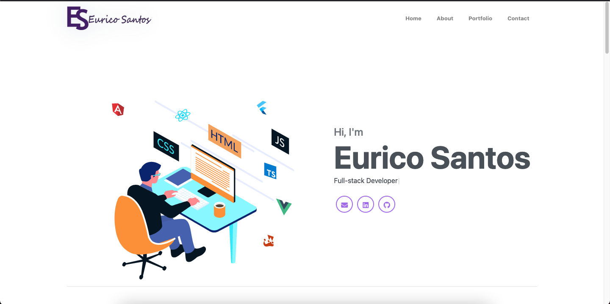
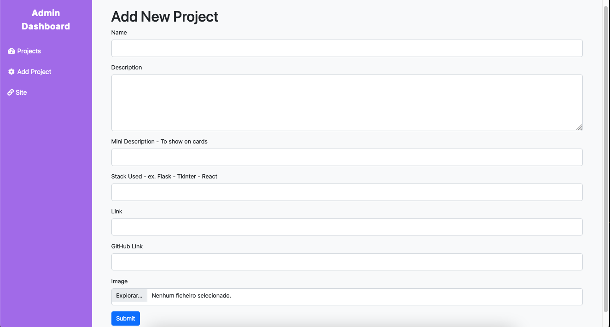

# **Portfolio Web Application**

This is a personal portfolio web application built with Flask, allowing you to showcase projects, information about yourself, and contact links. It also includes an admin panel for managing the projects listed in the portfolio.



## **Table of Contents**

- [About the Project](#about-the-project)
- [Technologies Used](#technologies-used)
- [Features](#features)
- [Deployment](#deployment)
- [Usage](#usage)
- [Admin page](#admin-page)
- [Available Routes](#available-routes)
- [Folder Structure](#folder-structure)
- [License](#license)

## **About the Project**

This project is a web application portfolio where you can present your projects and skills. It includes an admin panel protected by authentication where you can add, edit, and delete projects.

## **Technologies Used**

- **Flask:** Python web framework.
- **Flask-Login:** Authentication management.
- **SQLAlchemy:** ORM for the database.
- **Bootstrap 5:** CSS framework.
- **Vercel/Railway:** Hosting for development and production.
- **EmailJS:** Service to send emails directly from the client.

## **Features**

- Display portfolio with details about each project.
- Download the resume.
- Protected admin panel to manage projects.
- Create projects with image upload.
- Integration with EmailJS to send contact messages.

## **Deployment**

### **Vercel**
1. Add the necessary environment variables in the Vercel project settings.
2. Configure the `vercel.json` file to ensure Flask runs correctly.

### **Railway**
1. Add the environment variables to the Railway dashboard.
2. Set the startup command to use `gunicorn`:

    ```bash
    gunicorn -b 0.0.0.0:$PORT main:app
    ```

3. Deploy through the Railway dashboard.

## **Usage**

- Access the site to view the projects.
- Use the admin panel to add, edit, or delete projects.

## **Admin Page**

- Acess admin panel by url ``` ../admin ``` as you can see on Avaible routes below
- See all projects on dashboard
- Edit projects
- Add projects
  


## **Available Routes**

- **`/`**: Home page with projects.
- **`/admin`**: Admin panel (login required).
- **`/login`**: Login page.
- **`/logout`**: Logout.
- **`/add_project`**: Add a new project (login required).
- **`/edit_project/<int:project_id>`**: Edit an existing project (login required).
- **`/delete_project/<int:project_id>`**: Delete a project (login required).
- **`/download_cv`**: Download the resume.

## **Folder Structure**

```plaintext
portfolio-flask/
│
├── app/
│   ├── static/
│   │   ├── css/
│   │   ├── images/
│   │   ├── js/
│   └── templates/
│       ├── admin.html
│       ├── add_project.html
│       ├── base.html
│       ├── home.html
│       └── login.html
│
├── models.py
├── forms.py
├── routes.py
├── main.py
├── db.py
├── config.py
└── README.md
```
## **License**

This project is licensed under the MIT License - see the LICENSE file for details.
